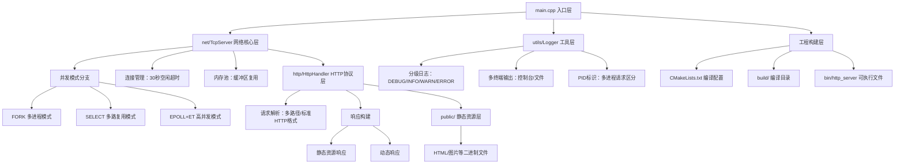

## 项目架构图

## 项目亮点 
1. **迭代清晰**：从单文件Socket逐步迭代至多模块**Epoll高并发**，Git标签（v1-v8）追溯全版本 
2. **性能卓越**：**Epoll ET模式**+**内存池复用**+30s空闲超时，1000请求压测后**RSS仅3.7MB左右**，无内存泄漏/飙升
3. **多模式兼容**：支持**Fork多进程/Select/Epoll**三种并发模式，命令行一键切换，适配不同场景需求
4. **工程规范**：**模块化拆分（net/http/utils）**、编译产物隔离、**分级日志+PID标识**，符合生产级开发标准

## 性能对比表格
| 并发模式       | 最大连接数 | IO模型       | 内存占用（1000请求） | 适用场景               | 对应版本 |
|----------------|------------|--------------|----------------------|------------------------|----------|
| Fork多进程     | 有限（进程开销） | 多进程独立IO | ≈20MB（多进程叠加）  | 简单场景、跨平台兼容   | v5       |
| Select多路复用 | 1024（系统限制） | 轮询监听     | ≈12MB               | 中小并发、跨平台需求  | v6       |
| Epoll+内存池   | 无上限（内核级） | 事件驱动O(1) | ≈3.7MB（稳定无飙升） | Linux高并发、生产场景  | v8       |

## 快速开始
### 1.环境依赖
- 系统：Linux(Epoll依赖、推荐Ubuntu 18.04+)
- 编译工具：CMake 3.10+、GCC 7+（支持C++11）

### 2.编译启动
```bash
# 克隆仓库
git clone https://github.com/Archer11-q/c-_socket_http_server.git
cd cpp_socket_http_server

# 编译（产物隔离至build/bin）
mkdir build && cd build
cmake .. && make -j4

# 启动服务器（支持3种模式：fork/select/epoll，默认epoll）
./bin/http_server epoll
```

## 3.功能测试
```bash
# 1.基础HTTP请求测试
curl http://localhost:8080/

# 2.压力测试（1000次请求，10并发）
ab -n 1000 -c 10 http://localhost:8080/

# 3.空闲连接超时测试（验证30s自动关闭）
nc -v -q 35 localhost:8080/  #建立连接后等待30s，查看服务器日志
```

## 版本迭代路线（体现项目演进）
| 版本   | 核心主题                | 关键特性                                  |
|--------|-------------------------|-------------------------------------------|
| v1     | 纯Socket Server         | TCP字节流回显，掌握Socket核心API（socket/bind/listen等） |
| v2     | 最小HTTP Server         | 支持GET / 路径，返回标准HTTP/1.1响应（响应行+头+体） |
| v3     | 多路径HTTP Server       | 扩展/、/index、/about三路径，兼容浏览器/nc访问 |
| v4     | 多模块拆分重构          | 拆分net/http/utils模块，适配CMake多文件编译 |
| v5     | Fork多进程并发          | 多进程处理请求，日志添加PID标识，支持静态文件传输 |
| v6     | Select IO多路复用       | 单进程监听多FD，突破1024连接限制，降低进程开销 |
| v7     | Epoll IO多路复用        | Linux专属高并发，ET模式+非阻塞FD，O(1)事件响应 |
| v8     | Keep-Alive与性能优化    | 30秒空闲连接超时+内存池缓冲区复用，RSS稳定≈3.7MB |

## 核心功能
1. **HTTP协议支持**：兼容GET请求，静态资源（HTML/图片）二进制传输，长连接（Keep-Alive）
2. **高并发优化**：Epoll ET模式事件驱动，O(1)事件响应，无连接数上限，适合Linux高并发场景
3. **资源管控**：空闲连接30秒自动关闭，8KB缓冲区池复用，避免内存碎片和泄漏
4. **工程规范**：模块化拆分、编译产物隔离、Git标签追溯全版本，符合生产级开发标准

---
> 项目基于C++11开发，聚焦「从基础到高阶」的HTTP服务器实现，适合学习Socket编程、IO多路复用（Select/Epoll）、服务器性能优化的开发者参考。
> 如有问题，欢迎提交Issue或Pull Request！
---
