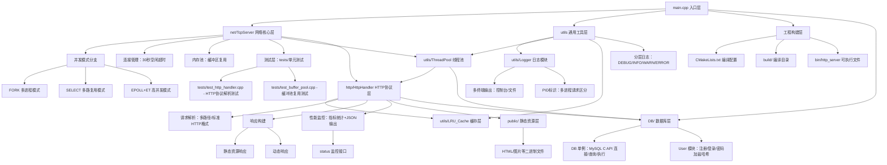

## 项目架构图

## 核心优化点（Challenge - Solution - Effect)
### 1.高并发I/O模型优化
- 挑战：传统阻塞I/O、进程开销大、无法支持高并发
- 方案：使用Linux epoll + ET边缘触发 + 非阻塞I/O，实现Reactor模型
- 效果：事件复杂度从O(n降为O(1)，单机支持大量并发连接

### 2.内存池优化缓冲区分配
- 挑战：频繁创建/销毁连接，大量小内存申请释放导致碎片与开销
- 方案：实现8KB固定大小内存池，预先分配，重复使用
- 效果：内存分配效率显著提升，压测1000次请求后RSS稳定在3.7MB左右

### 3.HTTP长连接与空闲连接回收
- 挑战：大量空闲连接占用文件描述符与内存
- 方案：支持Keep-Alive，设置30s空闲超时自动关闭
- 效果：连接复用率提升，服务器稳定性与资源利用率明显提高

### 4.工程化模块重构
- 挑战：早期单文件代码混乱、难以维护与拓展
- 方案：按功能拆分为 net / http / utils 三层模块，使用CMake构建
- 效果：结构清晰、易于拓展、便于调试，符合工业级项目规范

### 5.线程安全分级日志系统
- 挑战：多进程/高并发下日志混乱，无法快速定位问题
- 方案：实现单例、线程安全、带分级与时间戳的日志系统
- 效果：线上问题可快速追溯，支持高并发场景稳定输出

### 6.数据库持久化用户系统
- 挑战：服务器重启后用户数据丢失
- 方案：集成MySQL，实现注册/登录/密码加盐哈希
- 效果：数据可持久化，支持基本业务流程运行

### 7.线程池异步解耦优化
- 挑战：ET边缘触发模式下，IO线程同步执行业务逻辑易阻塞，导致事件处理延迟、并发能力下降
- 方案：引入动态线程池，将HTTP解析、业务处理、数据库操作等任务异步投递，IO线程与工作线程解耦
- 效果：IO线程无阻塞高效执行，服务器并发吞吐量显著提升，高并发场景下稳定性与响应速度大幅优化

### 8.单元测试体系构建
- 挑战：核心模块迭代重构后易引入回归缺陷，缺乏自动化验证机制
- 方案：基于GTest构建tests目录，覆盖HttpHandler接口边界与BufferPool核心逻辑
- 效果：自动化验证接口正确性，支撑后续模块重构不破坏底层逻辑

### 9.实时性能监控集成
- 挑战：服务运行状态无量化指标，高并发下无法直观观测负载与资源占用
- 方案：HttpHandler嵌入轻量埋点统计，新增/status接口输出JSON格式监控数据
- 效果：实时采集服务运行时长、请求数、QPS、内存、连接数，支持压测数据对标验证

## 项目亮点
1. **迭代清晰**：从单文件Socket逐步迭代至多模块**Epoll高并发**，Git标签（v1-v8）追溯全版本
2. **性能卓越**：**Epoll ET模式**+**内存池复用**+30s空闲超时，1000请求压测后**RSS仅3.7MB左右**，无内存泄漏/飙升
3. **多模式兼容**：支持**Fork多进程/Select/Epoll**三种并发模式，命令行一键切换，适配不同场景需求
4. **工程规范**：**模块化拆分（net/http/utils）**、编译产物隔离、**分级日志+PID标识**，符合生产级开发标准
5. **持久化存储**：集成MySQL数据库，实现用户注册、登录接口，密码加盐加密，支持数据持久化
6. **异步解耦**：基于Epoll ET+线程池实现**Reactor异步架构**，IO线程与工作线程分离，彻底解决同步阻塞瓶颈
7. **测试全覆盖**：建立tests/单元测试目录，完成HTTP协议解析与缓冲池核心逻辑的自动化用例覆盖，保障代码迭代稳定性
8. **实时性能监控**：内置服务状态监控模块，提供标准化JSONO监控接口，只管观测服务负载与资源使用情况

## 性能对比表格
| 并发模式       | 最大连接数 | IO模型       | 内存占用（1000请求） | 适用场景               | 对应版本 |
|----------------|------------|--------------|----------------------|------------------------|----------|
| Fork多进程     | 有限（进程开销） | 多进程独立IO | ≈20MB（多进程叠加）  | 简单场景、跨平台兼容   | v5       |
| Select多路复用 | 1024（系统限制） | 轮询监听     | ≈12MB               | 中小并发、跨平台需求  | v6       |
| Epoll+内存池   | 无上限（内核级） | 事件驱动O(1) | ≈3.7MB（稳定无飙升） | Linux高并发、生产场景  | v8       |

| 指标	     | 无线程池（基准）	 | 集成线程池（优化后）	| 提升幅度       |
|---------|-----|----------|------------|
| QPS（吞吐）	| 429	|4564	   | 提升 10.6 倍  |
| 平均延迟	| 380ms |	93ms	| 降低 75%     |
| 10 秒总请求数	| 4326	 | 45936 | 10 倍多      | 
| CPU 利用率	|双核 35%	|双核满载 80%+	|资源完全利用 |


## 快速开始
### 1.环境依赖
- 系统：Linux(Epoll依赖、推荐Ubuntu 18.04+)
- 编译工具：CMake 3.10+、GCC 7+（支持C++11）
- 数据库：MySQL 5.7+ / libmysqlclient-dev

### 2.编译启动
```bash
# 克隆仓库
git clone https://github.com/Archer11-q/c-_socket_http_server.git
cd cpp_socket_http_server

# 编译（产物隔离至build/bin）
mkdir build && cd build
cmake .. && make -j4

# 启动服务器（支持3种模式：fork/select/epoll，默认epoll）
./bin/http_server epoll
```

## 3.功能测试
```bash
# 1.基础HTTP请求测试
curl http://localhost:8080/

# 2.压力测试（1000次请求，10并发）
ab -n 1000 -c 10 http://localhost:8080/

# 3.空闲连接超时测试（验证30s自动关闭）
nc -v -q 35 localhost:8080/  #建立连接后等待30s，查看服务器日志

# 4.用户注册
curl -X POST http://localhost:8080/api/register -d "username=test&password=123456"

# 5.用户登录
curl -X POST http://localhost:8080/api/login -d "username=test&password=123456"

# 6.LRU缓存测试
./bin/http_server test lru

# 7.运行所有单元测试
./bin/test_all

# 8.单独运行HttpHandler测试
./bin/test_all --gtest_filter=HttpHandlerTest.*

# 9.单独运行BufferPool测试
./bin/test_all --gtest_filter=BufferPoolTest.*

# 10.查看服务性能监控
curl http://localhost:8080/status
```

## 版本迭代路线（体现项目演进）
| 版本   | 核心主题                | 关键特性                                                                       |
|--------|-------------------------|----------------------------------------------------------------------------|
| v1     | 纯Socket Server         | TCP字节流回显，掌握Socket核心API（socket/bind/listen等）                                |
| v2     | 最小HTTP Server         | 支持GET / 路径，返回标准HTTP/1.1响应（响应行+头+体）                                         |
| v3     | 多路径HTTP Server       | 扩展/、/index、/about三路径，兼容浏览器/nc访问                                            |
| v4     | 多模块拆分重构          | 拆分net/http/utils模块，适配CMake多文件编译                                            |
| v5     | Fork多进程并发          | 多进程处理请求，日志添加PID标识，支持静态文件传输                                                 |
| v6     | Select IO多路复用       | 单进程监听多FD，突破1024连接限制，降低进程开销                                                 |
| v7     | Epoll IO多路复用        | Linux专属高并发，ET模式+非阻塞FD，O(1)事件响应                                             |
| v8     | Keep-Alive与性能优化    | 30秒空闲连接超时+内存池缓冲区复用，RSS稳定≈3.7MB                                             |
| v9     | MySQL数据库集成         | 集成MySQL，实现用户注册/登录API，密码SHA256+salt加密                                       |
| v10    | 线程池异步解耦优化      | 引入线程池实现Epoll+ThreadPool异步Reactor架构，IO线程与工作线程分离，异步处理HTTP业务与数据库操作，消除ET模式阻塞风险 |
| v11    | LRU缓存集成与测试模块   | 集成LRU缓存优化用户登录性能，减少数据库查询；新增测试模块，支持命令行测试（如./http_server test lru） |
| v12   | 单元测试体系构建        | 搭建GTetst测试框架，完成HttpHandler与BufferPool全接口单元测试，建立tests/测试目录，实现自动化回归验证|
 | v13  | 性能监控模块集成        | 新增服务运行指标实时统计，实现/status监控接口，支持JSON疏忽，可对接压测完成性能验证                   |

## 核心功能
1. **HTTP协议支持**：兼容GET请求，静态资源（HTML/图片）二进制传输，长连接（Keep-Alive）
2. **高并发优化**：Epoll ET模式事件驱动，O(1)事件响应，无连接数上限，适合Linux高并发场景
3. **资源管控**：空闲连接30秒自动关闭，8KB缓冲区池复用，避免内存碎片和泄漏
4. **工程规范**：模块化拆分、编译产物隔离、Git标签追溯全版本，符合生产级开发标准
5. **用户系统**：集成MySQL数据库，提供/api/register、/api/login接口，支持用户注册、登录和数据持久化
6. **异步任务处理**：集成线程池实现任务异步执行，IO线程仅负责事件监听与读写分发，核心业务逻辑交由工作线程处理，避免阻塞
7. **LRU缓存优化**：集成LRU缓存机制，缓存用户认证数据，减少数据库查询，提升登录性能
8. **自动化测试支撑**：集成单元测试框架，覆盖HTTP协议解析边界场景与缓冲池复用逻辑，提供自动化验证能力，保障项目长期维护性
9. **实时性能监控**：内置轻量性能统计模块，提供/status监控接口，实时输出服务运行时长、总请求数、QPS7内存占用、活跃连接数核心指标

---
> 项目基于C++11开发，聚焦「从基础到高阶」的HTTP服务器实现，适合学习Socket编程、IO多路复用（Select/Epoll）、服务器性能优化的开发者参考。
> 如有问题，欢迎提交Issue或Pull Request！
---