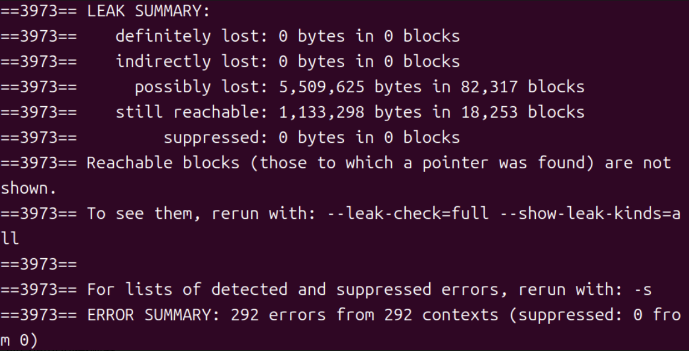

# 技术总结

## 项目架构概览
本项目是一个基于C++11开发的高性能HTTP服务器，采用Reactor事件驱动模型，支持高并发连接处理。项目架构分为以下模块：

- **网络层**：负责TCP连接管理、Epool事件循环、IO多路复用。核心文件包括TcpServer.h和TcpServer.cpp，实现连接监听、读写事件处理
- **HTTP协议层**：处理HTTP请求解析、响应构建。核心文件包括HttpHandler.h和HttpHandler.cpp，支持GET/POST请求，路由分发
- **业务层**：处理具体业务逻辑，如用户登录、状态查询。核心文件包括User.h和User.cpp，集成数据库操作
- **工具层**：提供通用工具，如日志、缓存、连接池、内存你吃。核心文件包括Logger.cpp、LRU_Cache.cpp、ThreadPool.cpp、MySQLPool.cpp等
- **数据库层**：负责数据持久化，使用MySQL连接池。核心文件包括DB.cpp和DB.hpp，支持用户认证、数据查询

## 核心技术点
### 1.**Epoll ET+ 线程池操作**
**问题**：项目中如何实现Epool边缘触发与线程池的协作？当前方案A的实现是什么？存在哪些问题和改进方向？
**回答**：项目采用Epool ET模式，主线程负责监听新连接和读事件，工作线程负责处理业务逻辑和写响应。当前方案A：主线程读取请求数据，放入任务队列；
         工作线程从队列取出任务，处理后写回响应。问题包括主线程可能成为瓶颈（读写分离不彻底），改进方向为方案B：主线程统一处理所有IO，工作线程仅处理计算密集型任务，以减少线程切换开销

### 2.**内存池设计**
**问题**：内存池如何设计？固定8KB块和自由链表如何工作？如何保持RSS稳定在12MB并避免碎片？
**回答**：内存池使用固定大小8KB块，通过自由链表管理空闲块。分配时从链表头取块，使用完后归还链表。RSS稳定通过预分配和循环使用实现，避免碎片通过固定大小和及时回收。测试显示在高并发下内存使用稳定，无泄漏

### 3.**MySQL连接池线程安全**
**问题**：MySQL连接池如何保证线程安全？已改造为每个工作线程独立连接或阻塞队列的具体实现是什么
**回答**：项目使用单例模式的全局共享连接池，通过互斥锁和条件变量保证线程安全，连接池维护一个队列存储可用连接，getConnection()使用unique_lock和条件变量阻塞等待可用连接，releaseConnection()归还连接通知并等待线程。

### 4.**密码加盐**
**问题**：用户密码如何加盐存储？随机盐的生成和存储机制是什么？未来如何改进？
**答案**：密码使用随机盐（基于简单随机数生成）与哈希结合存储。盐与哈希值一同存入数据库。未来可用std::random_device生成更安全的随机盐，提高安全性

###5.**异步日志**
**问题**：异步日志如何实现？生产者-消费者队列如何减少IO阻塞？
**答案**：使用单例AsyncLogger类维护std::queue<std::string>队列和后台工作线程。业务线程将日志消息入队，工作线程循环出队并写入文件，减少阻塞通过非阻塞入队和后台IO，提升QPS

### 6.**Status接口缓存优化**
**问题**：/status接口如何优化缓存？如何避免每次请求读取/proc？
**答案**：接口返回JSON格式的服务器状态，包括连接数、请求数、uptime、内存使用。优化通过缓存上次读取的/proc数据（每10秒更新），避免频繁系统调用。QPS通过总请求数除以运行时间计算，为平均QPS

### 7.**Valgrind内存检测结果**
**问题**：Valgrind检测结果如何？definitely lost:0 bytes的意义是什么？
**答案**：Valgrind显示definitely：0 bytes，表示无内存泄露。项目通过RAII确保资源管理。

### 8.**单元测试覆盖**
**问题**：单元测试如何覆盖？使用Google Test测试哪些模块？
**答案**：使用Google Test框架，测试连接池（分配/释放）、LRU缓存（存入/淘汰）、HTTP解析（路径提取）。配置CMake支持测试，确保模块正确性。

### 9.**性能数据**
**问题**：项目的性能数据如何？QPS 和延迟在不同并发下的表现？
**答案**：使用 wrk 压测 epoll 模式，线程池 16 个，移除模拟延迟。QPS 在高并发下稳步提升，但延迟随并发增加。表格展示：

| 并发数 | QPS | 平均延迟 (ms) |
|--------|-----|---------------|
| 100    | 13627| 15.30         |
| 1000   | 15960| 12.92         |
| 5000   | 18131| 36.17         |

注：高并发下 QPS 提升但延迟增加，符合服务器处理能力曲线

### 10.**项目迭代历程
**问题**：项目从v1到v15的迭代历程是什么？
**答案**：v1-v3：完成基础通信与HTTP协议实现，从纯Socket回显，到支持GET请求、多路径路由，兼容浏览器访问
         v4-v7：完成架构解耦与并发模型升级，拆分多模块并适配CMake，先后引入Fork多进程、Select、Epoll ET多路复用，解决并发瓶颈
         v8-v9：优化稳定性与业务能力，实现Keep-Alive长连接复用、内存池优化，并集成MySQL实现用户注册/登录，支持密码SHA256+salt加密
         v10-v12：实现业务与IO解耦及自动化测试，引入线程池异步解耦IO与业务，集成LRU缓存优化性能，搭建Google Test单元测试体系
         v13-v15：完成生产级性能与稳定性改造，新增/status性能监控接口并优化缓存，省级异步日志消除IO阻塞，重构MySQL连接池解决多线程安全隐患
